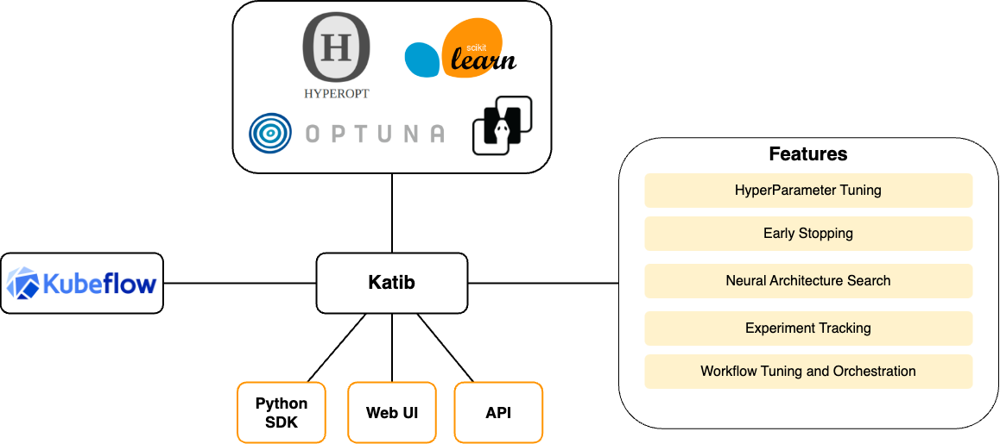
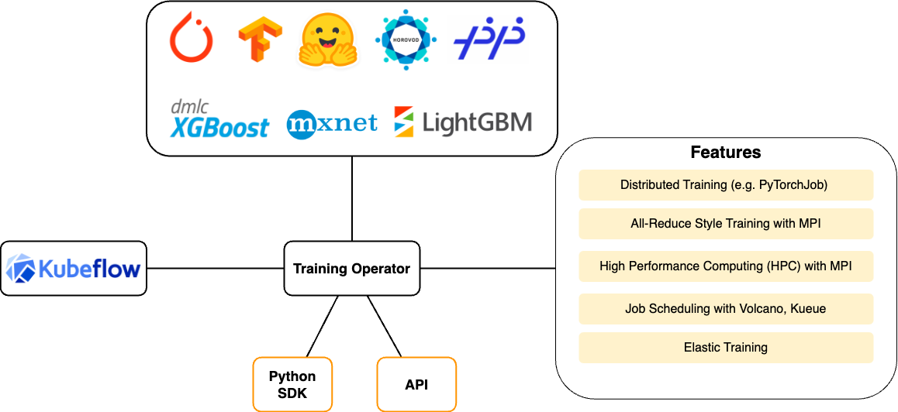
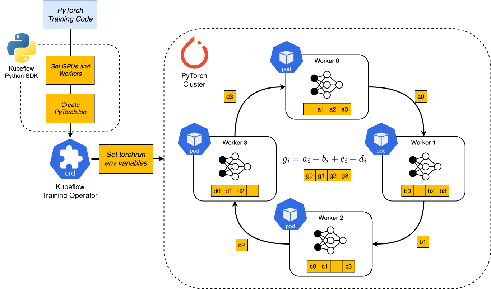
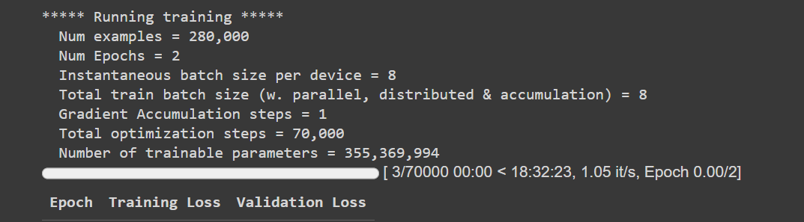
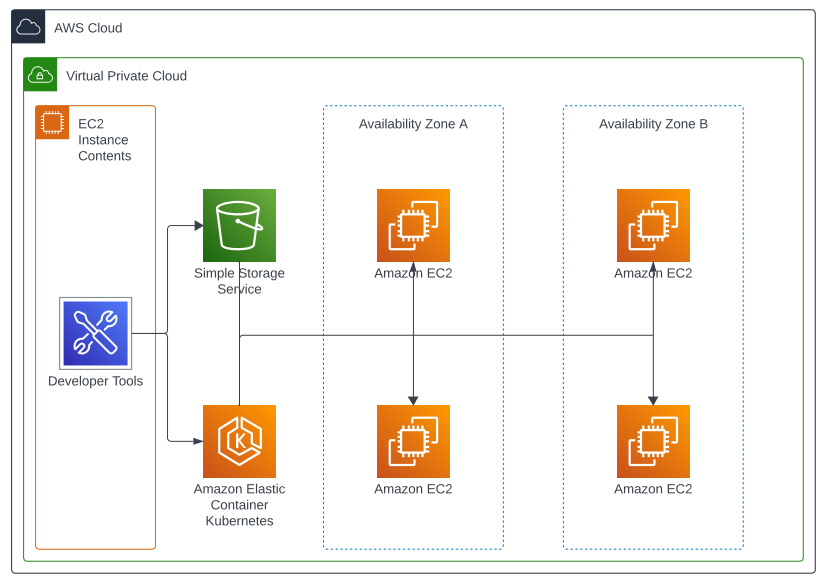
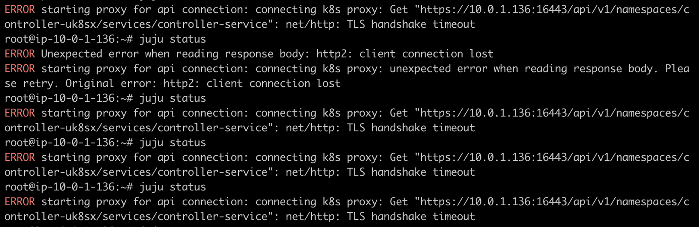

# Kubeflow

<p align="center">
  
   
</p>

# Zespół
grupy: 2 i 5, rok 2024
 - Antonina Kuś - konfiguracja Kubeflow
 - Szymon Paszkiewicz - infrastruktura AWS
 - Jędrzej Ziebura - modele AI
 - Szymon Żychowicz - dokumentacja, dashboard

# Tematyka
W dobie rosnącej popularności sztucznej inteligencji oraz coraz większej złożoności modeli rośnie zapotrzebowanie na moc obliczeniową. Aby ją osiągnąć można polepszać komponenty komputera, ale można także wykorzystać infrastrukturę rozproszoną. Jest to znacznie efektywniejsze środowisko. Kubeflow i AWS są technologiami będącymi odpowiedzią na to zapotrzebowanie.

# Technologia realizacji
**Kubeflow** służy do wdrażania i wykorzystywania modeli sztucznej inteligencji i uczenia maszynowego w prostym, przenośnym, skalowalnym, rozproszonym środowisku. Wszędzie gdzie używany jest Kubernetes łatwo można zaaplikować Kubeflow.\
\
Pomimo tego, że większość komponentów opiera swoje działanie na Pythonie i YAMLu, konkretna technologia zastosowana w projekcie zależeć będzie od wybranego komponentu, który będzie prezentowany. Przykładowo Kubeflow Pipelines (KFP) oparte są o Pythonowe SDK, konfiguracja Notebooks wykorzystuje Kubeflow GUI i YAMLe pliki konfiguracyjne, natomiast Kubeflow Training Operator (KTO) może korzystać ze znanych bibliotek MLowych tj. transformers, PyTorch lub DeepSpeed.\
\
Jako środowisko chmurowe zespół wykorzysuje **AWS**, który jest bogato wspierany przez kontrybutorów Kubeflow. W sieci dostępne jest dużo wsparcia dla tego rozwiązania przez jego popularność.

## Komponenty

### KF Pipelines `stable`
Kubeflow Pipelines (KFP) to platforma służąca budowaniu i wdrażaniu przenośnych i skalowalnych MLowych serwisów (workflows) za pomocą Dockerowych kontenerów. Jej dwa główne elementy, komponenty i pipeline’y, można stworzyć za pomocą Pythonowego SDK, a następnie skompilować je do pośredniej, YAMLowej reprezentacji co zapewnia przenośność rozwiązania. Tak zapisany workflow można zlecić do wykonania backendowi wspierającemu KFP, np. open source KFP backend lub Google Cloud Vertex AI Pipelines. Pierwszy z nich jest dostępny zarówno jako jedna z głównych funkcjonalności Kubeflow oraz jako osobna usługa.

### KF Notebooks `stable`
Kubeflow Notebook to platforma umożliwiająca tworzenie serwerów hostujących Jupyter Notebooki. Pozwala ona na konfiguracje poszczególnych serwerów i udostępnianiu ich publicznie.

### KF Dashboards `stable`
Dashboards jest komponentem umożliwiającym monitorowanie stanu Kubeflow. Umożliwia on tworzenie odpowiednich widoków, możliwych do skonfigurowania według preferencji użytkownika. Pozwala to na stworzenie pojedynczej strony z wszystkich istotnymi informacjami takimi jak logi, informacje o pipelinach, czy metryki informujące o aktualnym wykorzystaniu zasobów obliczeniowych.

### KF Katib - AutoML `beta`
AutoML jest komponentem w wersji beta służącym do finetuningu parametrów modelu.


### KF Kubeflow Training Operator - Model Training `stable`
Model Training jest platformą do trenowania modeli sztucznej inteligencji w środowisku rozproszonym. Umożliwia ona szkolenie modelu z wykorzystaniem takich frameworków jak PyTorch, czy TensorFlow. Udostępnia przy tym takie funkcjonalności jak określenie strategii nauki modelu w systemie rozproszonym, czy chociażby job scheduling.


### KF KServe `stable`
Jest platformą do wdrażania wytrenowanych modeli sztucznej inteligencji bazujący na istniejących już technologiach takich jak TFServing czy Triton Inference Server. W dodatku pokrywa on takie funkcjonalności jak logowanie, autoskalowanie, zapewnia authZ i authN, udostępnia metryki, pozwala na kontrolowanie ruchu z wykorzystaniem firewalli.

### AWS EKS
Amazon Elastic Kubernetes Service jest usługą zapewniającą wsparcie dla Kubernetesa. Wyręcza administratora z dużej części pracy nad instalacją i utrzymaniem Kubernetesowej platformy.

### AWS EC2
Amazon Elastic Compute Cloud pozwala na wypożyczanie wirtualnych maszyn na podstawie obrazu AMI. Wykorzystuje się je do uruchamiania na nich aplikacji. 

### AWS Terraform
Usługa ma za zadanie ułatwienie zarządzanie innymi komponentami AWS. Niesie wiele korzyści automatyzując proces stawiania aplikacji oraz wdrażania zmian redukując czynnik ludzki co ogranicza błędy. Wykorzystuje koncept IaC.

### AWS VPC
Amazon Virtual Private Cloud służy do logicznego podziału zarządzanej infrastruktury. Umożliwia utworzenie architektury sieciowej przypominającej tradycyjnie używanej lokalnie (niechmurowo).

### AWS S3
Amazon Simple Storage Service znany jako S3 jest serwisem zapewniającym dostęp do skalowanej, persystentnej pamięci o wysokiej dostępności w chmurze.

# Koncepcja rozważanego przypadku użycia
Wykorzystanie systemu można podzielić na 2 fazy. Są to faza trenowania modelu SI oraz jego serwowania. System zapewnia także możliwość śledzenia metryk, co pozwala analizować jego wydajność kiedy ten pracuje.

### Faza trenowania modelu sztucznej inteligencji
Do trenowania modelu wykorzystany zostanie Kubeflow Trainig Operator. Jest to platforma do trenowania modeli sztucznej inteligencji w środowisku rozproszonym.
Pozwala wykorzystać zasoby Kubernetesa do efektywnego treningu poprzez Kubernetes Custom Resources APIs.

W naszym projekcie zostanie wykorzystany framework PyTorch wraz z PyTorchJob. Trainig Operator odpowiada za planowanie odpowiednich 
obciążeń Kubernetesa do implementacji różnych strategii szkolenia rozproszonego dla różnych frameworków używanych w uczeniu maszynowym.

Wykorzystany jest do tego algorytm ring all-reduce. To algorytm służący do redukcji wszystkich wartości przetwarzanych 
przez różne węzły klastra do jednej globalnej wartości. Algorytm ten wykorzystuje topologię pierścienia, gdzie dane 
są przesyłane pomiędzy węzłami wzdłuż cyklicznej ścieżki. Każdy węzeł przekazuje swoje dane do sąsiada, który następnie
dokonuje odpowiednich operacji arytmetycznych (na przykład dodawanie) na otrzymanych danych oraz własnych, a następnie
przesyła je dalej. Proces ten kontynuuje się, aż wszystkie węzły otrzymają zaktualizowane dane. Na poniższym diagramie
przedstawiono działanie tego algorytmu we frameworku PyTorch.

<p align="center">
  
</p>

### Faza serwowania modelu
W celu serwowania modelu wykorzystana zostanie Kserve. Platforma dostarczająca zestaw interfejsów udostępniających model sztucznej inteligencji. 
Bazuje ona na gotowych rozwiązaniach wprowadzanych przez takie biblioteki jak TFServing, TorchServe, czy Triton Inference Server. 
W ramach demo wykorzystany zostanie wcześniej wytrenowany model. Zostanie on wystawiony z wykorzystaniem narzędzi i w pełni obsłużony. 
Pokazane zostanie API powstałe na bazie interfejsów, metryki generowane przez interfejsy oraz możliwe takie funkcjonalności jak AuthZ, AuthN oraz logowanie. 
Ważne przy uwzględnieniu tej fazy jest ilość kodu wygenerowana w trakcie tworzenia infrastruktury oraz przedstawienie dogmatu IaC.

### Słowo wstępu do modelu i zbioru treningowego
 Kluczową obserwacją w przypadku zbioru danych i modelu, na którym zostanie przeprowadzone demo, jest fakt, że nie są one punktem centralnym projektu,
a jedynie środkiem do pokazania możliwości KFTO i KServe'a, zatem sama jakość wytrenowanego modelu, czy jego adekwatność do danego zadania nie jest szczególnie istotna. Najważniejszym parametrem
zarówno modelu jak i zbioru treningowego jest **wielkość**, ponieważ to ona pozwoli nam uwydatnić zalety Kubeflow.
_________
### Wybrany model
Niemniej jednak wybrano pasujące do siebie model i zadanie z nadzieją osiągnięcia satrysfakcjonującego wyniku.

Wybranym modelem jest [RoBERTa-large](https://huggingface.co/FacebookAI/roberta-large), czyli model w architekturze transformer w wariancie encoder-only. Posiada on **355 milionów parametrów**, a jego zapis w wersji binarnej waży około **1.43GB**. 
Jego wielkość praktycznie uniemożliwia efektywne trenowanie na pojedynczym CPU, więc dobrze nadaje się do pokazania efektywności Kubeflow.
__________
### Zbiór treningowy
Ponieważ modele typu encoder-only najlepiej radzą sobie w zadaniach należących do NLU (Natural Language Understanding) takich jak klasyfikacja tokenów (NER, PoS tagging) czy klasyfikacja tekstu (analiza sentymentu, detekcja spamu) zdecydowano się na
wybór zbioru danych umożliwiających wytrenowanie modelu w zadaniu drugiego z wymienionych typów - wieloklasowej klasyfikacji tekstu.

Do tego zadania wybrano zbiór danych [Yahoo anserws topics](https://huggingface.co/datasets/yahoo_answers_topics?row=1), który w zbiorze treningowym posiada aż **1.4 miliona** przykładów. Jest to tak ogromna ilość iż może okazać się, że w projekcie zostanie użyta tylko część zbioru.

Dla ukazania skali zbioru Yahoo, porównajmy go ze  zbiorem [SQuAD v2](https://huggingface.co/datasets/rajpurkar/squad_v2) autorstwa uniwersytetu Stanford, do zadania polegającego na odpowiadania na pytania (ang. question-answering). Uważany za duży zbiór posiada tylko około 130 tysięcy próbek w zbiorze treningowym. Jest zatem prawie 11 razy mniejszy od Yahoo.
________
### Uzasadanienie wyboru
Aby pokazać, że trening wybranego modelu na powyższym zbiorze danych na pojedyńczym CPU lub GPU jest zadaniem karkołomnym stworzono [demo notebook](showcases/SUU_model_training_showcase.ipynb), gdzie RoBERTę próbujemy trenować na zaledwie 20% zbioru Yahoo.

Poniżej możemy zobaczyć przewidywany czas treningu o długośći dwóch epok (dwukrotne wykorzystanie próbek treningowych) na zasobach platformy Google Colab.

* Przykład na CPU - 2 procesory Intel(R) Xeon(R) CPU @ 2.20GHz - pamięć RAM przepełnia się zanim załaduje się progress bar. Zwykle gdy używamy GPU mówimy o około 10-cio krotnym przyśpieszeniu treningu. Nawet jeśli założymy 8-krotne wydłużenie czasu, otrzymujemy 148H, czyli trochę ponad 6 dni.
* Dla karty T4 GPU, która ma 16GB RAMu praktycznie od razu ta pamięć się przepełnia i otrzymujemy błąd ```OutOfMemoryError: CUDA out of memory```

<p align="center">
  
  <p align="center">Przykład na GPU - karta graficzna T4 - przewidywany czas treningu &rarr; 18.5H</p>
</p>

# Architektura rozwiązania

<p align="center">
  
  <p align="center">Infrastruktura chmurowa dla demo</p>
</p>

Infrastruktura chmurowa bazuje na zasobach dostarczonych przez AWS. 
Wykorzystywana jest dedykowana platforma EKS służącą do zarządzania infrastrukturą z pomocą narzędzia Kubernetes. 
Jest ona, także głównym zasobem Kubeflow, którym zarządza i buduje swoją konfigurację na niej. 
Kubeflow potrzebuje odpowiedniego środowiska w celu inicjalizacji na nim pracy. 
Jednym wymogów jest wykorzystywanie systemu Ubuntu. W tym celu powstał kontroler Kubeflow, 
będący maszyną EC2 z odpowiednią konfiguracją. Podczas inicjalizacji pobiera wszystkie potrzebne aplikacje i biblioteki 
oraz ustawia zmienne środowiskowe, tak by użytkownik mógł od razu używać tego narzędzia. Infrastruktura jest wykorzystywana
w obu podpunktach demo w trakcie trenowania, jak i w trakcie serwowania modelu.

W trakcie testowania Kubeflow na AWS napotkaliśmy problem w postaci ograniczonych możliwości kont do nauki.
Nie byliśmy w stanie stworzyć ról koniecznych do inicjalizacji frameworka na platformie EKS. 

Alternatywne rozwiązanie nie wykorzystujące platformy AWS, a korzysta z narzędzia Kind. Jest to open-source'owe rozwiązanie
do testowania infrastruktury Kubernetesowej na lokalnym środowisku. Pozwoliłoby to symulowanie środowiska chmurowego bez ograniczeń
narzuconych przez konta dostarczane przez uczelnie. Rozwiązanie to dawałoby wymiernie gorsze wyniki w stosunku
do rozwiązania opartego o środowisko chmurowe.

# Opis konfiguracji

```yaml
apiVersion: serving.kserve.io/v1beta1
kind: InferenceService
metadata:
  annotations:
    sidecar.istio.io/inject: 'false'
  name: half-plus-two
  namespace: ${PROFILE_NAMESPACE}
spec:
  predictor:
    model:
      modelFormat:
        name: tensorflow
      storageUri: ${S3_BUCKET_URI}
    serviceAccountName: aws-sa
```

Konfiguracja KServe do prawidłowego funkcjonowania potrzebuje serwisu S3, 
na którym umieszczony będzie odpowiednio skonfigurowany model oraz platformy Lambda do wykonywania operacji bez serwera. 
Użycie tej technologii zasadniczo redukuje koszty wynikające z utrzymaniem serwera oraz pozwala 
na swobodne skalowanie w zależności od liczby żądań usługi.

```yaml
apiVersion: "kubeflow.org/v1"
kind: PyTorchJob
metadata:
  name: pytorch-simple
  namespace: kubeflow
spec:
  pytorchReplicaSpecs:
    Master:
      replicas: 1
      restartPolicy: OnFailure
      template:
        spec:
          containers:
            - name: pytorch
              image: docker.io/kubeflowkatib/pytorch-mnist:v1beta1-45c5727
              imagePullPolicy: Always
              command:
                - "python3"
                - "/opt/pytorch-mnist/mnist.py"
                - "--epochs=1"
    Worker:
      replicas: 4
      restartPolicy: OnFailure
      template:
        spec:
          containers:
            - name: pytorch
              image: docker.io/kubeflowkatib/pytorch-mnist:v1beta1-45c5727
              imagePullPolicy: Always
              command:
                - "python3"
                - "/opt/pytorch-mnist/mnist.py"
                - "--epochs=1"
```

W celu rozpoczęcia trenowania modelu sztucznej inteligencji wykorzystywana jest definicja serwisu Kubernetesowego przedstawiona powyżej.
Tworzy ona workerów z wgranym kodem oraz predefiniowanymi parametrami.

# Instalacja
Do inicjalizacji konieczne jest najpierw pobranie i odpowiednie skonfigurowanie poniższych aplikacji:
- Terraform
- AWS-CLI

W przypadku Terraforma należy tak skonfigurować to narzędzie, by możliwe było uruchomienie go z wiersza poleceń.

W przypadku AWS-CLI należy dodatkowo skonfigurować referencje do konta, tak by wszystkie operacje wykonywane przez Terraforma były autoryzowane z konta właściciela.

### Instrukcja inicjalizacji systemu
By zainicjalizować system należy przejść do folderu /aws/terraform. W nim należy wykonać dwie komendy:
```shell
terraform init
```
a następnie:
```shell
terraform apply
```
W trakcie tego terraform poprosi użytkownika o zatwierdzenie zmian. Następnie Terraform stworzy wszystkie potrzebne zasoby na chmurze i inicjalizuje system. Po około półtorej godziny Kubeflow powinien być gotowy.

W ten sposób powstaje architektura, na której oprzeć można zarówno KServe, jak i KTFO.


# Wdrożenie i użytkowanie demo
## Skrypt treningowy w Pythonie
Za pomocą dostępnych źródeł i doświadczeń zebranych z wcześniejszych eksperymentów utworzono plik pythonowy, [training.py](./training.py) koordynujący inicjalizację modelu i preprocessing zbioru danych, a następnie uruchamiający trening za pomocą biblioteki `transformers` w rozproszonym środowisku utworzonym przez Kubeflow. Plik jest samowystarczalną bazą, konieczną do uruchomienia i przeprowadzenia treningu, ale nie konfiguruje on środowiska, w którym ma się on odbyć. Ta czynność może być wykonana na dwa różne sposoby. Jeśli chcemy uruchomić trening z poziomu jupyterowego notebooka możemy skorzystać z metody udostępnianej przez bibliotekę `kubeflow` &rarr; **TrainingClient().create_job()**. Alternatywnie można stworzyć odpowiedni plik yamlowy, jeśli preferujemy uruchamianie treningu z konsoli , np. przez aws cli.

## Plik konfiguracyjny yaml
```yaml
apiVersion: kubeflow.org/v1
kind: PTJob
metadata:
 name: suu-kubeflow
spec:
 tfReplicaSpecs:
    Worker:
      replicas: 2
      restartPolicy: unless-stopped
      template:
        spec:
          containers:
          - name: suu-kubeflow
            image: rzepson/suu-kubeflow:0.2
```

Aby uruchomić trening za pomocą Kubeflow należy wykonać następującą komendę:

```shell
kubectl apply -f <name_of_yaml_file>.yaml -n kubeflow
```

Podczas prób deploymentu za pomocą Juju, pojawia się błąd przedstawiony na poniższym zrzucie ekranu. Jest to wynik komendy ```juju status```, która reportuje status deployowanej aplikacji.



## Próba inicjalizacji środowiska bezpośrednio na microk8s

# Podsumowanie i wnioski
Przykłady z dokumantacji Kubeflow, w tym pokazowy trening modelu BERT świetnie pokazują mocne strony proponowanego rozwiązania, tj. przyśpieszenie treningu dużych sieci neuronowych za pomocą rozproszonych algorytmów, np. ring-reduce, zarówno na procesorach, jak i kartach graficznych. Kubeflow jest świetną alternatywą dla osób nieposiadających odpowiednich zasobów sprzętowych, w szczególności jednostek GPU oraz dla osób mniej biegłych w obsłudze rozwiązań chmurowych, ponieważ uruchomienie treningu z poziomu jupyterowego notebooka jest bardzo proste, o ile tylko czeka na nas przygotowana odpowiednia infrastruktura. To właśnie okazało się problemem nie do pokonania w naszym projekcie. Konta studenckie AWS Academy nie zapewniały uprawnień wystarczających do utworzenia odpowiedniego środowiska dla Kubeflow. Próby rozwiązania tej kwestii w alternatywny sposób za pomoca juju lub poprzez inicjalizację Kubeflow bezpośrednio na klastrze microk8s nie powiodły się. 

Zakładając, iż posiadanie faktycznego konta AWS rozwiązałoby problemy inicjalizacji środowiska, możemy ocenić samą ideę Kubeflow training operator bardzo pozytywnie. Warto jednak zwrócić uwagę na fakt, iż nie eliminuje on kompletnie konieczności znajmości narzędzi udostępnianych przez AWS, co wciąż pozostaje "słabym punktem" w rozproszonym procesie treningowym dla osób ściśle związanych wyłacznie ze środowiskiem analizy danych. W dobie, gdy obie te gałęzie informatyki rozwijają się bardzo szybko, KFTO może szybko zyskać na popularności.

# Referencje
* [Oficjalna dokumentacja Kubeflow - poradnik jak uruchomić PyTorchJob za pomocą pliku yamlowego](https://www.kubeflow.org/docs/components/training/user-guides/pytorch/)
* [Poradnik jak uruchomić Kubeflow Training Operator lokalnie za pomocą pliku yamlowego i obrazu Dockerowego](https://medium.com/@shivasubramaniam1516/run-a-ml-model-in-kubernets-using-kubeflow-training-operator-d32dda2face5)
* [Oficjalny tutorial Kubeflow jak uruchomić PyTorchJob z poziomu notebooka ipynb](https://github.com/kubeflow/training-operator/blob/master/examples/pytorch/text-classification/Fine-Tune-BERT-LLM.ipynb?fbclid=IwZXh0bgNhZW0CMTAAAR2LLY_qi87jzNTC9QHkrOJnO_D_hFS3iOlFslIOgBlucuLQD94JPAL-HyQ_aem_AVRWquGe2vX8l4knJWy_7iJdvYjdBdwmYyk4Mdu61RQF5-bM0n_ypCoTANslnFRc-1N7PeCA809aHMiXZiZCwmQb)
